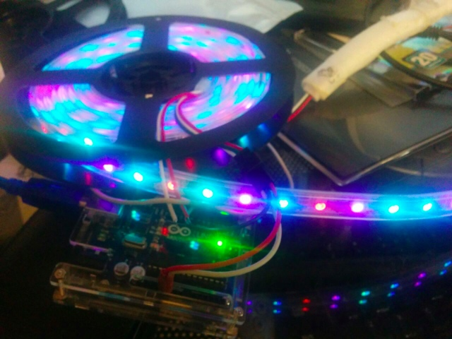
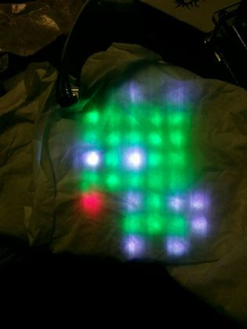
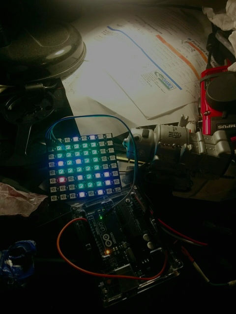
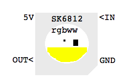

FAB_LED
=======

Welcome to the Fast Arduino Bitbang (FAB) LED library.

This library is meant to be a very compact, fast library to drive your addressable LEDs.

Feedback!
---------

Important: I would really appreciate feedback from people using this LED library, here's how.

* Watch/star/comment/help contribute FAB_LED in [GIT](https://github.com/sonyhome/FAB_LED)
* Comment to my blog entry for FAB_LED on [Wordpress](https://dntruong.wordpress.com/2016/03/23/my-ws2812b-library-with-palettes)
* Comment to my forum entry for FAB_LED on [Arduino.cc](http://forum.arduino.cc/index.php?topic=392074.0)

Installation
------------

The FAB_LED library is installed like any other Arduino library:

* Download the library from the [master repository](https://github.com/sonyhome/FAB_LED/archive/master.zip).
* Unzip the FAB_LED_main directory and files.
* Move the directory and its content to your Arduino library directory.
  On most platforms it will be under your documents folder:
  `Documents/Arduino/libraries`
* Launch the Arduino IDE program
* Try some examples
  * Connect your Arduino board with a LED strip wired to pin D6 of the board
  * Load one of the examples menu File/Examples/FAB_LED_master/examples/...
  * Compile and load the example (Ctrl-U or Command-U)


Why FAB_LED is better
---------------------

There are a few well establised LED libraries that are very popular:
* [Adafruit Neopixel library](https://github.com/sonyhome/Adafruit)
* [FastLED linrary](https://github.com/sonyhome/FastLED)

So why FAB_LED? WHY?

Because I'm not happy with these libraries. I want something simple, super small, super fast, and super flexible.
I think I've achieved more of that than the above libraries.

Here's some properties that may or may not be apparent benefits to you until you start using the libraries:

* The FAB_LED bit-banging code is not coded in assembly, but in C.
That makes it portable to Arduino boards of any frequency 8MHz and above (8MHz is untested).
  * It should work on AVR and ARM Arduino boards (untested on ARM).
  * It supports a wide range of wire protocols for the LEDs.
  * The library supports WS2812, WS2812B, APA104, APA106, SK6812 and other similar addressable color LEDs, with RGB, GRB, BGR, RGBW LED formats and timings, 3 or 4 byte per pixels.
    * It is easy to add new LEDs with different timings and color mappings.
    (APA102 and SPI-communication LEDs are in plan)
  * Porting for platforms other than Arduino is possible. It will just require implementing a replacement for I/O ports manipulation and for interrupt disabling. (Raspberry Pi port might happen) 

In terms of usability, and memory footprint I believe FAB_LED is supperior to the libraries mentioned above.

* FAB_LED compiles smaller, and runs faster than the other libraries, demonstrations below.
* You manipulate the LED pixel array directly, it is NOT embedded into the LED class. This allows you much easier control of your patterns.
  * In fact I plan to provide some primitives to manipulate pixel arrays to support 2D displays and sprites.
* The LED library implements direct display routines, to which you pass the pixel array.
  * FAB_LED supports many pixel representations to facilitate importing patterns from other programs like Gimp.
  * FAB_LED supports palettes natively.
    * FAB_LED palettes allow very large pixel arrays in a small memory footprint. For example 2KB of RAM can fit up to 2042 two-tone pixels, 1280 pixels with 256 colors, 682 24-bit pixels or 512 32-bit pixels.
      Note: if you have 256K of RAM or more, FAB_LED is limited to 64K pixels currently, because it uses a uint16_t to control the pixel offset for efficiency, but can be converted to uint32_t, however one LED strip of 64K pixels would have a very slow refresh rate.
      Note: On an Arduino Uno, you have 2K of RAM, which also needs to hold other data AND your program stack. Therefore you cannot use all 2kB to allocate the LED strip. In practice I believe you have about 750 bytes available for that.
    * FAB_LED palettes allow you to do palette based special effects. For example you can rotate colors without having to redraw your patterns.
* FAB_LED display routines can be called back to back, which opens many opportunities.
  * FAB_LED allows you to control an infinite number of LEDs even with a small 16MHz Arduino.
  * Ability to draw patterns repeatedly to support large displays. Just disable interrupts, and call sendPixels() repeatedly.
  * Ability to display separate pixel arrays for new visual effects. Just call sendPixels() repeatedly with different input pixel arrays.
  * Ability to display on the same port using multiple LED formats, to allow mix-n-match of otherwise signal incompatible LEDs, for example to embbed RGB APA106 LEDs with GRB WS2812B or RGWB SK6812 LEDs. This is useful to use LEDs that come with different physical properties and formats, for art projects. Just declare multiple LED strip objects on the same port, and use the one matching your LED strip model at the right pixel offset.
* FAB_LED can write an array in parallel
  * To two ports for ws2812b LEDs and alike on 16MHz Arduino and higher, for faster displays. It can do so so splitting the array into blocks (ws2812bs) , or interleaving the pixels of the array (ws2812bi).
  * To 8 ports for ws2812b LEDs and alike on 16MHz Arduino, if it's the same array sent to all ports
  * to 8 ports for APA-102 (SPI protocol) - to be implemented-

To demonstrate the benefits of FAB_LED, here are apples-to-apples comparison code snippets to do the same thing with different LED libraires, with compilation results for an Arduino Uno target, compiled on Mac, with Arduino 1.6.7:

### Adafruit NeoPixel library

NeoPixel librar requires 2.8kB of Flash memory.

```
#include <Adafruit_NeoPixel.h>

Adafruit_NeoPixel pixels = Adafruit_NeoPixel(
  8, 6, NEO_GRB + NEO_KHZ800);

void setup() {
  pixels.begin();
}

void loop() {
    pixels.setPixelColor(7, pixels.Color(16,0,0));
    pixels.show();
    delay(1000);
}
```

`Sketch uses 2,846 bytes (8%) of program storage space. Maximum is 32,256 bytes.
Global variables use 40 bytes (1%) of dynamic memory, leaving 2,008 bytes for local variables. Maximum is 2,048 bytes.`

### Adafruit DotStar library

DotStar requires a minimum of 2.8kB or Flash memory.

```
#include <Adafruit_DotStar.h>
#include <SPI.h> 

Adafruit_DotStar strip = Adafruit_DotStar(8, 4, 5, DOTSTAR_BRG);

void setup() {
  strip.begin();
}

void loop() {
  strip.setPixelColor(7, 16); 
  strip.show();
  delay(1000);
}
```

`Sketch uses 2,826 bytes (8%) of program storage space. Maximum is 32,256 bytes.
Global variables use 37 bytes (1%) of dynamic memory, leaving 2,011 bytes for local variables. Maximum is 2,048 bytes.`

### FastLED

FastLED 3.x uses 3.8kB of Flash memory and 105 bytes of RAM!

```
#include <FastLED.h>
CRGB leds[8] = {};

void setup() { 
  	  FastLED.addLeds<NEOPIXEL, 3>(leds, 8);
}

void loop() { 
  leds[7] = CRGB::Red;
  FastLED.show();
  delay(1000);
}
```

` #warning FastLED version 3.001.001  (Not really a warning, just telling you here.)
Sketch uses 3,864 bytes (11%) of program storage space. Maximum is 32,256 bytes.
Global variables use 105 bytes (5%) of dynamic memory, leaving 1,943 bytes for local variables. Maximum is 2,048 bytes.`

### FAB_LED library

FAB_LED requires only 736B of Flash memory.

```
#include <FAB_LED.h>
ws2812b<D,6> myLeds;
grb pix[8] = {};

void setup() { }

void loop()
{
	pix[7].r = 16;
	myLeds.sendPixels(8, pix);
	delay(1000);
}
```

`Sketch uses 736 bytes (2%) of program storage space. Maximum is 32,256 bytes.
Global variables use 34 bytes (1%) of dynamic memory, leaving 2,014 bytes for local variables. Maximum is 2,048 bytes.`

FAB_LED memory footprint is almost <B>4X smaller than Adafruit's library</B>.

If you even look at the Arduino basic examples, the FAB_LED example uses even less memory than the
01.Basics/Blink example (1039 bytes of program storage space and 9 bytes of DRAM)!

Furthermore, from my calculations, the overhead of FAB_LED for the above code should be 146 bytes, with the rest
of the memory usage being for the Arduino infrastructure code. This means FAB_LED memory footprint is close to what
it would be if the program was coded in assembly.

Examples
========

Here you will find photos of how the example code shipped with the FAB_LED library. Please refer to these
videos to verify the output on your LEDs is as expected. If it is not exactly as expected, you may be using
the wrong LED model definition.

AA_SimpleDemo
_____________
This example shows how simple it is to address the LEDs with this library. With about 10 lines of code, we have a cool effect, and
the complex part is it calls random() to pick a pixel to update, and random() again for each color, to pick a random color.
There are actually only 4 lines that are related to using the LED library.

<iframe width="560" height="315" src="https://www.youtube.com/embed/XfvVzaV4vOs" frameborder="0" allowfullscreen></iframe>

<a href="https://www.youtube.com/embed/XfvVzaV4vOs"
target="_blank"></a>

```
#include <FAB_LED.h>

// FAB_LED provides many types of LEDs, here we use a WS2812B LED protocol on port D6
ws2812b<D,6> myLedStrip;

// grb is provided by FAB_LED for convenience. WS2812B natively uses GRB LEDs.
// other LED types include rgb, grbw, rgbw, bgr... You can also use uint8_t or uint32_t.
grb pixels[8] = {};

void setup() {
  myLedStrip.clear(1000);
}

void loop() {
  uint16_t pos = random(8);
  pixels[pos].r = random(16);
  pixels[pos].g = random(16);
  pixels[pos].b = random(16);

  // You fully manage your array (unlike other LED libraries which embed it
  // into their class), and just send it when you're ready to show it.
  myLedStrip.sendPixels(8, pixels);

  delay(100);
}
```

A_testPixelStruct
-----------------
This example demonstrates the use of the LED structures that allow you to access directly the red, green and blue components of each pixel.
The structures abstract the pixels, so even though we offer multiple formats (rgb, grb, rgbw, etc.) they actually all will work with your
LED strip, no matter what is the natural order of the colors for your LED model.

It is however more efficient to use the natural order (it is faster).
You can use this example to detect the model of your LED strip, as the default display is red, green, blue, white.

The setup() routine sets up the different pixel type arrays with a specific color for each.
They are shown in order so that red shows first, then green, etc.

The code excerpt below is simpler than the actual code. The code actually has one routine per LED model,
and the main loop calls one of them, with all the others commented out.

<a href="https://www.youtube.com/watch?v=fI9f-9K0C0M"
target="_blank"></a>

```
#include <FAB_LED.h>

ws2812b<D,6> myWs2812;

#define NUM_PIXELS 40

rgbw rgbwPixels[NUM_PIXELS] = {};
grbw grbwPixels[NUM_PIXELS] = {};
rgb   rgbPixels[NUM_PIXELS] = {};
grb   grbPixels[NUM_PIXELS] = {};


void setup() {
  for (int i=0; i < 40; i++) {
  // Initialize rgb array to show as red strip
  rgbPixels[i].r = 16;
  // Initialise grb array to show as green
  grbPixels[i].g = 16;
  // Initialize grbw array to show as blue
  rgbwPixels[i].b = 16;
  // Initialize rgbw array to show as white
  grbwPixels[i].r = 16;
  grbwPixels[i].g = 16;
  grbwPixels[i].b = 16;
  }
}

loop() {
  myWs2812b.clear(1000);
  delay(500);

  showWs2812b();
}

void showWs2812b(void) {
  // Show rgb array (red)
  myWs2812.sendPixels(40, rgbPixels);
  // Wait to have display lit for a while
  delay(1000);
  // Show grb array (green)
  myWs2812.sendPixels(40, grbPixels);
  delay(1000);
  // Show rgbw array (blue)
  myWs2812.sendPixels(40, rgbwPixels);
  delay(1000);
  // Show grbw array (white)
  myWs2812.sendPixels(40 ,grbwPixels);
  delay(1000);
}
```

B_DebugConsole
--------------
This example prints informations on the serial console using the `Serial` class.
On startup, it displays the properties of the LED protocol used by the program.

It then loops doing multiple display demos, and for each prints out the memory used by the pixel array needed for that mode.

<a href="https://www.youtube.com/watch?v=uJeqUJm0ouU"
target="_blank"></a>

```

class avrBitbangLedStrip<...>
16MHz CPU, 62500 picoseconds per cycle
ONE  HIGH=8 LOW=2 cycles
ZERO HIGH=2 LOW=4 cycles
GRB REFRESH MSEC=20
DATA_PORT D.6, ONE-PORT (bitbang)

colorN(8,0,0)
Pixels array size=24

colorN(0,8,0)
Pixels array size=24

colorN(0,0,8)
Pixels array size=24

color1(0, 0,0,255)
Pixels array size=3

color1(1, 0,255,0)
Pixels array size=6

color1(2, 255,0,0)
Pixels array size=9

color1N(4,4,0)
Pixels array size=3

rainbow(16)
Pixels array size=24

rainbow(16)
Pixels array size=24

rainbow1N(16)
Pixels array size=3

jitter()
array size=21
```

C_testInfinitePixels
--------------------

This example shows some simple LED animations that use up almost no RAM, that can be applied to an almost infinite number of pixels.
By default the test is configured to drive 1000 pixels, and in practice the LED library as is is limited to 64K pixels per port.
For example, the rainbow effect provided stores only one pixel in RAM to drive all 1000 pixels of the strip (excerpt of the code below as proof).

<a href="https://www.youtube.com/watch?v=NiCUeifl74Y"
target="_blank"></a>

```
void rainbow1N(uint8_t brightness) {
 rgb pix[1];

 pix[0].r = brightness;
 pix[0].g = 0;
 pix[0].b = 0;

 for (uint16_t iter = 0; iter < 20 ; iter++) {

  const uint8_t oldSREG = SREG;
  __builtin_avr_cli();

  // This loop draws all the pixels of the LED strip
  for (uint16_t i = 0; i < numPixels ; i++) {
   myLeds.sendPixels(1, pix);

   // Change the colors based on the pixel's previous color
   // by walking each color of the rainbow
   colorWheel(1, pix[0].r, pix[0].g, pix[0].b);
  }

  SREG = oldSREG;

  // Wait, and refresh the LED strip
  delay(100);
 }
}
```

D_raw24bit
----------
This is an earlier example that shows how to use the library with basic uint8_t arrays,
instead of using the predefined pixel types like grb, etc.

In this case the programmer has to know and handle exactly the position of each pixel colors
and do the math for each pixel offset in the array. It's not very complex but a bit more
error prone, and much less portable across LED strip protocols.

```
#include <FAB_LED.h>
const uint16_t numPixels = 16;
ws2812b<D,6> myLeds;

#define   RED(x, i) x[i]
#define GREEN(x, i) x[i+1]
#define  BLUE(x, i) x[i+2]

void colorN(uint8_t red, uint8_t green, uint8_t blue)
{
	// We multiply by 3 because A pixel is 3 bytes, {G,R,B}
	uint8_t array[3*numPixels] = {};

	// Set each set of 3 bytes for every pixel
	for (uint16_t i = 0; i < numPixels; i++) {
		  RED(array, i) = red;
		GREEN(array, i) = green;
		 BLUE(array, i) = blue;
	}

	myLeds.sendPixels(numPixels, array);
}

```

E_FABLED_size
-------------
This sketch is meant to compare the compiled size of a program using FAB_LED vs using Adafruit's library, vs using FastLED.
All this program does is make a simple pixel array and display it. It's ery boring.

F_manyPorts
-----------
This example demonstrates how to update LED strips connected to multiple port pins.
* by writing to each strip separately
* by writting to two strips in parallel using ws2812bs (split), each strip getting 1/2 the array
* by writting to two strips in parallel using ws2812bi (interleave), one strip getting the odd and the other the even pixels.
* by writting a custom function to send the same pixels to all the ports
* by writting a custom function to send interleaved each pixels to each strip. On Arduino this does not work until all but one LED strip update is commented out.
The LEDs are lit by a RGB checkerboard. The test is designed to shimmer the pixels at a frequency that indicates how fast the LEDs are being refreshed to see how fast is each method.

Since not all port are updated by ws2812bs/ws2812bi, in between sequences 2 white pixels are drawn.

```
#include <FAB_LED.h>
const uint16_t numPixels = 4*8;
const uint16_t maxBrightness = 16;

// Write to ports D6 and D7.
ws2812bs<D,6,D,7> strip_split67;

// Displays numPixel on each LED strip
grb  grbPixels[2*numPixels] = {};

void setup(void)
{
  for(uint8_t i = 0; i < 2*numPixels; i++) {
    grbPixels[i].r = maxBrightness * ( i   %3 == 0);
    grbPixels[i].g = maxBrightness * ((i+2)%3 == 0);
    grbPixels[i].b = maxBrightness * ((i+1)%3 == 0);
  }
}

void loop(void)
{
  strip_split67.sendPixels(2*numPixels, grbPixels);
  delay(250);
}
```

Demos
=====

Here you will find examples of uses of the FAB_LED library that are not shipped with the library. These can be personal projects, extensions and features not implemented yet.

170+ LED reel
-------------

A validation that FAB_LED can address very large LED strips, using very little DRAM.
A small array holds a pattern in memory, and the `SendPixels()` method is called in a loop
to repeate the pattern on the LED strip.

  

First 2D use
------------

This displays an 8x8 pixels picture on an 8x8 pixel array, addressed left to right, top to bottom.
The drawing was exported to C from Gimp, and the colors retouched: You need less bright, pure colors.  
The display layout matches the 2D array in memory.
I plan to support more complex mappings.

  
  

Sk6812
------

Loial's first attempt at using the FAB_LED library, using sk6812 rgb LEDs.

<a href="https://youtu.be/BiE-9_EtXDg"
target="_blank"></a>

I received my sk6812 rgbww and it is pretty bright.
It is very hard to find the notch for the pinout, so I made a diagram:

  

Soldering ws2812b + sk6812-rgbw
-------------------------------
Lukas decided to solder back to back LED strips using different color protocols.
This demo shows that FAB_LED allowed him to send the right pixel formats to each strip,
from the same pixel array in memory. This allows him to focus drawing the right pattern
in the array and letting the library handle the display.

<a href="https://www.youtube.com/embed/hlfaLeGNjjM"
target="_blank"></a>

Below is the display routine that handles the mixed LEDs with different protocols.
`pixCut` is the offset where the LED strips were spliced together.

We use grbw (4 byte) pixels so he can set the white channel, which is ignored by ws2812b, but not the sk6812 leds.
We could have used a grb pixel which uses less RAM, but then there would be no way to control the white color
in the sk6812 pixels.

```
// Define two LED communication protocols on the same port, D6.
ws2812b<D,6> myWs2812b; // grb  protocol
sk6812<D,6>  mySk6812;  // rgbw protocol

#define NUM_WS2812B_PIXELS 16
#define NUM_SK6812_PIXELS  32
#define NUM_PIXELS (NUM_SK6812_PIXELS + NUM_WS2812B_PIXELS)

// This is a custom drawing routine for the specific configuration
void customSendPiels(grbw pixels) {
  // Don't forget to turn off interrupts if calling functions back-to-back
  __builtin_avr_cli();
  myWs2812b.sendPixels(NUM_WS2812B_PIXELS, &pixels[0]);
  mySk6812b.sendPixels(NUM_SK6812_PIXELS,  &pixels[NUM_WS2812B_PIXELS]);
  SREG = oldSREG;
}

grbw myPixels[NUM_PIXELS] = {};

void loop() {
  update(myPixels);
  customSendPiels(myPixels);
  delay(1000);
}
```

Details
=======

Pixel formats
-------------
* Supports multiple full-color pixel sizes:
  * 24 bit pixels (3 bytes),
  * 32 bit pixels (4 bytes, one unused)
  * 16 bit pixels (5 bit per pixel, plus 3 bit brightness).
* Supports palettes for 1, 2, 4 and 8-bit per pixels:
  Define a palette array of 2, 4, 16 or 256 colors.
  Define a pixel array which stores the index of the color in the palette array.
  * Palette management is done on the fly with the bit-banging so the library
    It does not waste memory allocating a temporary pixel unlike other libraries.
  * With 1 bit per pixels, you can draw patterns on a strip with over
    6,000 pixels (756 bytes) with a Uno, before running out of memory.
* LED sendPixels() calls can be chained.
  * To repeat a pattern or write different smaller pixel arrays, it is
    repeat calls to the `sendPixels()` method.
* Convenient pixel types allow you to access pixel colors without display errors.
  * Types: rgb, grb, bgr, rgbw...
  * Use the type native to your LED strip to have the most efficient code.
  * LED library will automatically transform the pixel color order on the fly if
    you do not use the native type for the LED strip you are using. The LEDs will
    therefore show the right colors no matter which format you use, at the price
    of a slight loss of performance and extra code. This will be transparent to you.
  * If you use the native pixel type for your LED strip, you can also cast the
    pixel array back and forth to an untyped pixel array (uint8_t * or uint32_t *)
    to do manipulations. The untyped pixel arrays will be a bit more efficient to
    display with `sendPixels()`.
* Support 1 or 2 ports. Two ports allow to update two LED strips in parrallel, for faster writes, either into 2 stripes or interleaved pixels.

Bio
===

I just recently started playing with Arduino in 2015, for my own art projects.
I have been using Adafruit's library which is great, but I've outgrown it:

In my professional life I have decades of C and performance engineering for OS and compilers, and I strive to use
the most efficient solution with the smallest weakest controller that can fullfill my results requirements.
Among other things I really like the AtTiny85, and wiring it directly to make very compact projects. However I want
them to really shine. With the Adafruit library I've run out of RAM to make cool stuff, so I decided to build my
own library from scratch. Reading <i>Josh.com</i> blog, I got to understand what makes ws2812b LEDs tick, and it
opened the doors to this. It is an opportunity for me to contribute to the community something I think is cool,
instead of just coding for my corporate master.

I do not believe performance, memory footprint and functionality are antinomic and that one has to make compromises
and sacrifices. With FAB_LED, I try to provide very fast code (so you can chain the `sendPixels()` calls for example),
super tight memeory management (so you can have more value add code and control more pixels), and leverage the simplified
interfaces to actually provide more artistic possibilities.

This exercise is also to prove to myself I can use C++ to write good, efficient code. Up to now, I have been
very skeptical of C++ and OO programming in general looking at thee resulting code programmers usually generate.
I was also very skeptical as a CS architect sensitized to memory behavior when I first saw STL templates and the notion of containers.
I have now learned that template constants are actually very useful, and more powerful than the C `#define` macro alternatives,
and that C++ syntax with strict coding style can actually be beneficial to generate beautiful code.

Dan- Apr 2016.

Planned Features
================

* Improved Palette support. I need to make palettes support pixel types, and provide very intuitive manipulation routines.
* Pixel remapping: I want to implement a map of all the pixels in space, to remap a 2D array ilogical layout in memory to the physical layout of the LEDs. Example of use cases:
  * For practical reasons, multiple LEDs have data wired differently than the order they are supposed to trigger, because of the geometry of the art project.
* 2D size support:
  pictures may be bigger or smaller than the LED display. There is a need to do an alignment on display knowing the dimension of the original picture, and the offset where to display it.
* 2D/3D LED display remapping support:
   For multi-dimensional projects, the physical layout may not be a rectangle, or may have holes. Even if the logical display is kept as a 2D rectangle to simplify animations, the mapping will allow skipping display of non-existing pixels, or as above, light up pixels in an order different than the logical order if the data lines are routed to minimize wire length.
* 2D sprite support:
  I'd like to be able to move an array into a display array, possibly as an overlay, to provide basic animation possibilities.

Validation Tests
================

This table shows the hardware FAB_LED has been tried on successfully.

Hardware          | Test    | Tester
---               |:---:    |-----:
`Controllers`     |         |
Arduino Uno       | Pass    | Sonyhome
AtTiny85 16MHz    | Pass    | Sonyhome
 | |
`LEDs`            |         |
ws2812bs          | Pass    | Sonyhome
ws2812bi          | Pass    | Sonyhome
ws2812b           | Pass    | Sonyhome
Apa-104           | Pass    | Sonyhome
Apa-106           | Pass    | Sonyhome
sk6812b rgb       | Pass    | Loial
sk6812b grbw      | Pass    | Lukony
mix ws2812b+Apa106| Pass    | Sonyhome
mix ws2812b+sk6812| Pass    | Lukony

Pending

mblade, wolfwings - ARM0 teensy 3.2 120 & 144mhz  
trash - sk6812 (rgbw)  

Releases
========

There is no official 1.0 release yet: This is still beta code, and I am requesting help from
3rd party to try the code and report issues, and engage with me to discuss features, interfaces and
design style. However I do my best to make sure the code is stable and bug free.

* April 15, 2016 Added support for sk6812, added pixel types, rewrote the readme documentation.  
* April 01, 2016 Beta with 3 examples, one for infinite LED strips, one printing stats to Serial console,
                 hearbeat on pin13/PortB5, the LED on the Arduino Uno board
                 Added apa104, ws2812b and ws2812 classes. The ws2812b class by default will have the most
                 aggressive timings to push data 2X faster to the strips.
                 Bug fixes: example function declarations reformated to compile on Mac, slowed 1H timing
                 to work with more LED strip types.  
* March 23, 2016 Beta with one example for 24bit pixels.  
